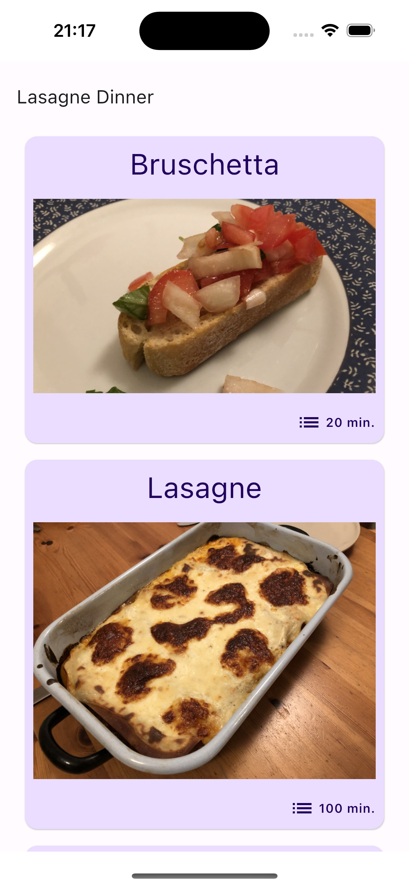
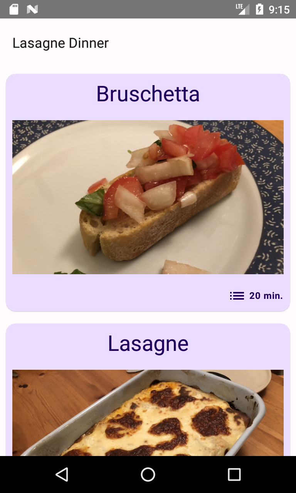

# LasagneDinner

## Overview

Lasagne Dinner is a small project that began as my first learning experience with Android using 
XML-based layouts and Java. It has evolved over time into a cross-platform application 
utilizing Kotlin Multiplatform and Compose Multiplatform.

## Technologies

_Kotlin Multiplatform_ | _Android_ | _Java_ | _Kotlin_ | _iOS_ | _Koin_ | _Compose Multiplatform_ 

## Images

 

## Usage

### Prerequisites

- Android Studio (See: https://developer.android.com/studio/install)
- Kotlin Multiplatform Environment (See: https://www.jetbrains.com/help/kotlin-multiplatform-dev/multiplatform-setup.html)

### Installation

1. Clone this repository:
   ```bash
   git clone https://github.com/chris-prenissl/LasagneDinner.git
   ```

2. Start a iOS or Android device

3. Open Android Studio with the project and run the iOS or Android build target.

## License

This project is licensed under the MIT License - see the [LICENSE](LICENSE.md) file for details.